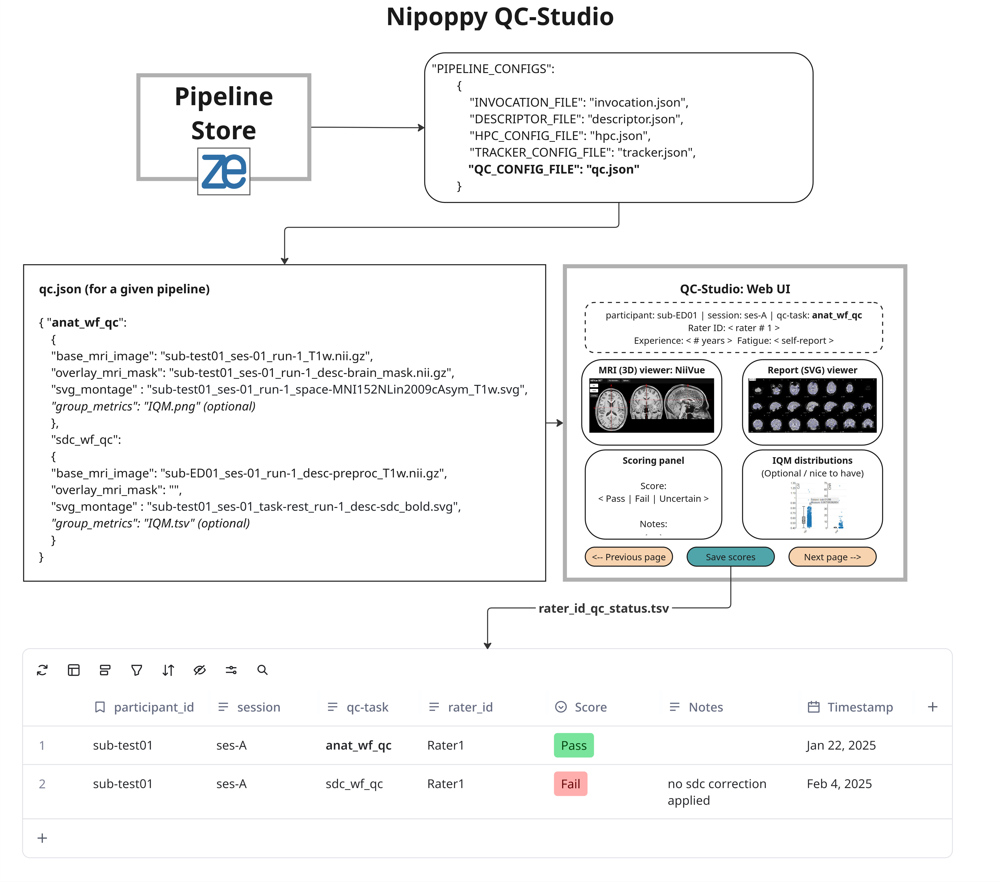

# QC-Studio MVP Scope

## Desgin Overview

## Key requirements: datatypes / formats
- Support visualization of curated data
    - Raw BIDS (TBD: how to handle relative paths not starting from `derivatives`)
    - MRIQC 

- Support visualization of processed data from these pipelines 
    - fMRIPrep 
    - Freesurfer / fsqc
    - QSIPrep
    - QSIRecon 

## Key requirements: UI
- Visualize 3D MRI using niivue
- Display flat image montages 
- Display IQMs (optional for MVP) 

## Constraints 
- User has full access to data either locally or via ssh 
- QC UI is populated based on files listed in the `pipeline_qc.json` (fixed schema) 
    - Does allow custom “qc-task” definitions. 
- Only single base image and overlay in niivue panel 
- Only SVGs or PNGs for montage viewer. No HTMLs. 
- Only pass | fail | uncertain ratings supported 

## Tasks
- Configs
    - Generate `pipeline_qc.json` (see [sample_qc.json](./ui/sample_qc.json))

- UI-orchestrator (see [ui.py](./ui/ui.py))
    - Handle argparse
    - Web-app init / global parameters
    - Calls to data handler
    - Calls to layout

- UI-data-handler 
    - Write Pydantic json parser (see [models.py](./ui/models.py))
    - Write data loaders (see [utils.py](./ui/utils.py))
        - MRI
        - SVGs
        - TSVs (IQMs)
    - Handle chunking for pagination (TODO)
        - n_subjects per page 
        - n_QC tasks per page 

- UI-layout (see [layout.py](./ui/layout.py))
    - Overall layout manager → handle 4 display panels 
    - Niivue streamlit plug-in to support base + overlay images 
    - SVG panel 
    - IQM panel (optional for MVP)
    - Rating panel 

- Write <rater>_qc_scores.tsv (see [layout.py](./ui/layout.py))
     - Handle overwrite / append  